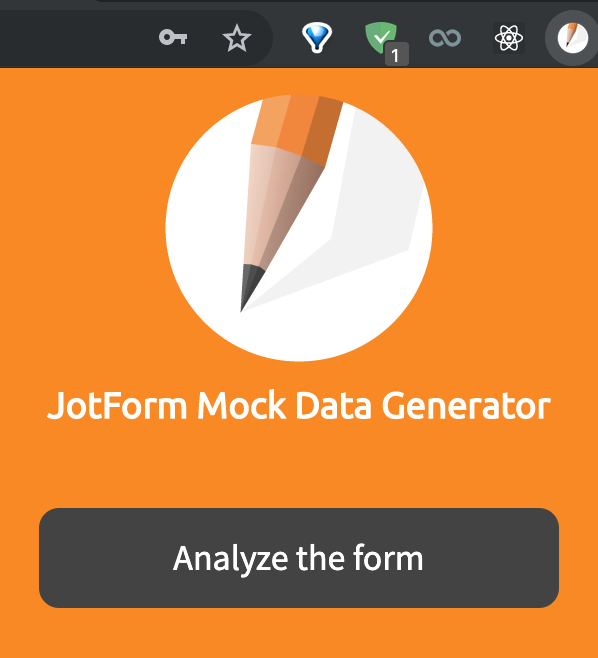
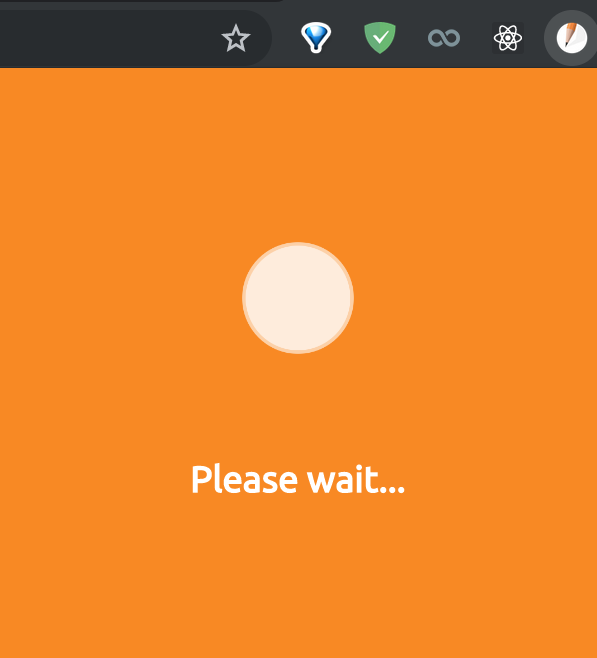
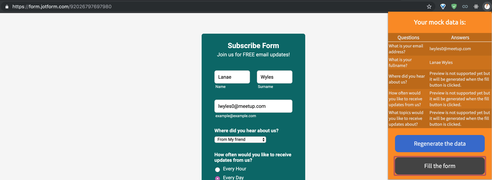

## JotForm Mock Data Generator Extension

This is a browser application that dynamically analyzes any form inputs and offers you to generate mock data for any JotForm form works on Chrome, Opera, Edge & Firefox.

